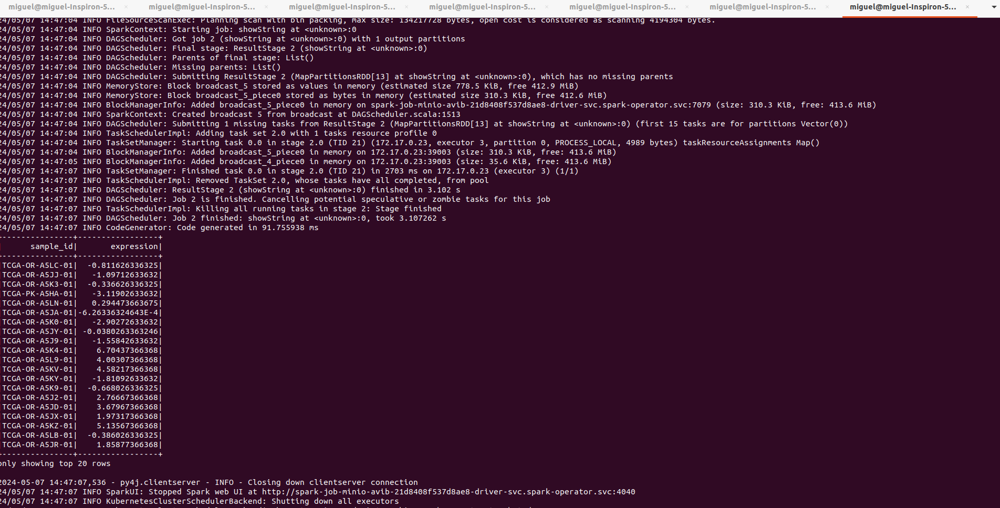

# Description
Spark permit develop analysis in a distributed way in our case SQL requests against to minio repository


## Steps to install
**STEP01**: Install helm official repository for spark opperator to access manage spark applications

```shell
helm repo add spark-operator https://googlecloudplatform.github.io/spark-on-k8s-operator
```

**STEP02**: Install spark operator version 3.3.1 under spark-operator namespace

```shell
helm install avib-spark-operator spark-operator/spark-operator \
--namespace spark-operator \
--set webhook.enable=true \
--set image.repository=openlake/spark-operator \
--set image.tag=3.3.1 \
--create-namespace
```

**STEP03**: add secret credentials to access azure container registry from operator installed in spark-operator namespace

create file azure-cr-credentials.yaml

```shell
apiVersion: v1
data:
  .dockerconfigjson: eyJhdXRocyI6eyJhdmliZG9ja2VyLmF6dXJlY3IuaW8iOnsidXNlcm5hbWUiOiJhdmliZG9ja2VyIiwicGFzc3dvcmQiOiJCQXFCZEhWYnJTbVBPeEg5NmxHSGxjemU3Z3g4bGNJc1dKTnhVRnl4L2MrQUNSQjErTDVNIiwiYXV0aCI6IllYWnBZbVJ2WTJ0bGNqcENRWEZDWkVoV1luSlRiVkJQZUVnNU5teEhTR3hqZW1VM1ozZzRiR05KYzFkS1RuaFZSbmw0TDJNclFVTlNRakVyVERWTiJ9fX0=
kind: Secret
metadata:
  name: acr-avib-secret
  namespace: spark-operator  
type: kubernetes.io/dockerconfigjson
deploy this resource

kubectl apply -f azure-cr-credentials.yaml
```

**STEP04**: create a secret for minio credentials to be used by our poc spark application to connect to minio and recover resources

```shell
kubectl create secret generic minio-secret \
--from-literal=AWS_ACCESS_KEY_ID=gl8rbGORHSpxmg1V \
--from-literal=AWS_SECRET_ACCESS_KEY=8WphDMckYqRb29s43SzA4trsV2GgaQRc \
--from-literal=ENDPOINT=gsdpi-hl.default.svc.cluster.local:9000 \
--from-literal=AWS_REGION=us-east-1 \
--namespace spark-operator
```

**STEP05**: create our spark application implemented in python like this:

Create file **src/main.py**

```shell
import os
import logging

from pyspark import SparkContext
from pyspark.sql import SparkSession
from pyspark.sql.types import StructType, StructField, FloatType, StringType
from pyspark.sql.functions import expr, column

logging.basicConfig(level=logging.INFO, format="%(asctime)s - %(name)s - %(levelname)s - %(message)s")
logger = logging.getLogger("AVIBSparkJob")

spark = SparkSession.builder.getOrCreate()

def load_config(spark_context: SparkContext):
    spark_context._jsc.hadoopConfiguration().set("fs.s3a.access.key", os.getenv("AWS_ACCESS_KEY_ID", "gl8rbGORHSpxmg1V"))
    spark_context._jsc.hadoopConfiguration().set("fs.s3a.secret.key", os.getenv("AWS_SECRET_ACCESS_KEY", "8WphDMckYqRb29s43SzA4trsV2GgaQRc"))
    spark_context._jsc.hadoopConfiguration().set("fs.s3a.endpoint", os.getenv("ENDPOINT", "gsdpi-hl.default.svc.cluster.local:9000"))
    spark_context._jsc.hadoopConfiguration().set("fs.s3a.connection.ssl.enabled", "true")
    spark_context._jsc.hadoopConfiguration().set("fs.s3a.path.style.access", "true")
    spark_context._jsc.hadoopConfiguration().set("fs.s3a.attempts.maximum", "1")
    spark_context._jsc.hadoopConfiguration().set("fs.s3a.connection.establish.timeout", "5000")
    spark_context._jsc.hadoopConfiguration().set("fs.s3a.connection.timeout", "10000")

load_config(spark.sparkContext)

# Read CSV file from Minio
df = spark.read.option("header", "true").option("inferSchema", "true").csv("s3a://65cd021098d02623c46da92d/65cd02d9e6ba3947be825ac8/66085488056b08fae55840e5/gen_datamatrix.csv")

# Filter dataframe by annotation column name
annotation_df = df.select(column(df.columns[0]).alias("sample_id"), column("HIF3A").alias("expression"))

# show annotation spark dataframe result
annotation_df.show()
```

**STEP06**: create the spark application driver docker image to be used by the spark operator

Create file **Dockerfile** including the certificate inside keystore because the connection to minio is over SSL

```shell
FROM openlake/spark-py:3.3.1
USER root

# JVM which runs Hadoop needs a custom ca certificate
COPY cert/ca.crt .
RUN keytool -import -trustcacerts -keystore $JAVA_HOME/lib/security/cacerts -storepass changeit -noprompt -alias tls -file ca.crt

WORKDIR /app
RUN pip3 install pyspark==3.3.1
COPY src/*.py .
Build image:

docker build -t avibdocker.azurecr.io/sparkjob-avib:1.4.0 .
```

**STEP07**: push image to azure container registry

```shell
docker push avibdocker.azurecr.io/sparkjob-avib:1.4.0
```

**STEP08**: create spark application deployment to be executed by spark operator

create file sparkjob-minio-avib.yaml

```shell
apiVersion: "sparkoperator.k8s.io/v1beta2"
kind: SparkApplication
metadata:
    name: spark-job-minio-avib
    namespace: spark-operator
spec:
    type: Python
    pythonVersion: "3"
    mode: cluster
    imagePullSecrets:
      - acr-avib-secret
    image: avibdocker.azurecr.io/sparkjob-avib:1.4.0
    imagePullPolicy: Always
    mainApplicationFile: local:///app/main.py
    sparkVersion: "3.3.1"
    restartPolicy:
        type: OnFailure
        onFailureRetries: 3
        onFailureRetryInterval: 10
        onSubmissionFailureRetries: 5
        onSubmissionFailureRetryInterval: 20
    driver:
        cores: 1
        memory: "1024m"
        labels:
            version: 3.3.1
        serviceAccount: avib-spark-operator
        env:
            -   name: AWS_REGION
                value: us-east-1
            -   name: AWS_ACCESS_KEY_ID
                value: gl8rbGORHSpxmg1V
            -   name: AWS_SECRET_ACCESS_KEY
                value: 8WphDMckYqRb29s43SzA4trsV2GgaQRc
    executor:
        cores: 1
        instances: 3
        memory: "1024m"
        labels:
            version: 3.3.1
        env:
            -   name: INPUT_PATH
                value: "s3a://65cd021098d02623c46da92d/65cd02d9e6ba3947be825ac8/66085488056b08fae55840e5/gen_datamatrix.csv"
            -   name: AWS_REGION
                valueFrom:
                    secretKeyRef:
                        name: minio-secret
                        key: AWS_REGION
            -   name: AWS_ACCESS_KEY_ID
                valueFrom:
                    secretKeyRef:
                        name: minio-secret
                        key: AWS_ACCESS_KEY_ID
            -   name: AWS_SECRET_ACCESS_KEY
                valueFrom:
                    secretKeyRef:
                        name: minio-secret
                        key: AWS_SECRET_ACCESS_KEY
            -   name: ENDPOINT
                valueFrom:
                    secretKeyRef:
                        name: minio-secret
                        key: ENDPOINT
```

Deploy resource:

```shell
kubectl apply -f sparkjob-minio-avib.yaml
```

**STEP09**: monitoring spark driver application

```shell
kubectl logs -n spark-operator spark-job-minio-avib-driver --follow
```


